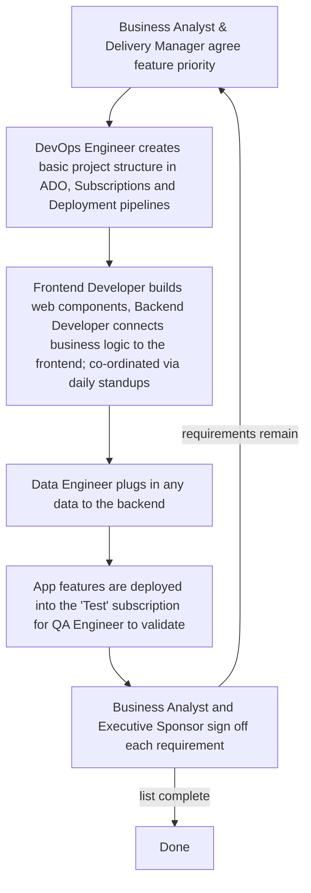

# Quality Diagnosis <!-- 500 words -->

The organisation is seeking to speed up application delivery by leveraging AI in both the product design and development phases. 

AI's most significant impact has been on how delivery time expectations are managed. This impacts the legacy app design, governance, coding, testing and change management process so we'll look at that first in order to compare it with the new 'AI' driven approach.

## Current Development Practice

Business analysts, prompeted by specific customer needs, undertake a requirements gathering exercise which (after a number of weeks or months) makes it's way into a Statement of Work (SOW).

A team is then formed around the SOW with each member having a role: a Business Analyst, Executive Sponsor, Technical Architect, Frontend and Backend Developers, Data Engineer, QA Engineer, Delivery Manager and DevOps Engineer.

The team starts work on delivering against the SOW and producing a High Level Design (HLD) document.

This document goes to the Digital Design Authority (DDA) for technical review and then to the Change Advisory Board (CAB) for a broader business review. The CAB is primarily focussed on whether all the organisations security, testing and deployment policies have been followed since their goal is to manage organisational risk. (TODO: find a quote for this paragraph)

Development _can_ start before the CAB has approved the approach but an App cannot be deployed into production (use) before approval but enerally all development follows the loop below: -

Figure 1: Development Loop

## Design and Testing as related to Software Quality Outcomes

<!-- (TODO: need to write more about the Design aspect of Software quality as an outcome!) -->

Historically developers would not write unit tests (REF: how ofter TDD really) and the software wouldn't be developed with design patterns in mind beyone what the Technical Architect has mandatad at a high level. (REF: get a quote for this). 

Testing has been entirely manual following a Test Plan created and managed inside Azure DevOps (ADO) that requires a QA Engineer to loop through all the tests manually to find bugs.

Given the organisation's move to both AI driven product development (TODO: Link to further chapter here) and AI agent implemented Application code, driven from the requirements backlog, this necessitates filling some gaps 

<!--
(TODO: rewrite this, it's not clear what the point is) -->

## Current Quality Gaps

### Application testing gaps 

Developers have not had to write unit tests because they could simply hand over their application changes to the QA Engineer. 

<!-- (TODO: Quote ref Observability and "you build it you run it" as well as Programmer Anarchy <-- reference this >) -->

This is an inadequate approach. An example of this is when a refactoring change was made to clean up a security token. There was a specific code path where the 'cleanup' occurred before the page was resubmitted, therefore breaking the application. This change was committed into git on the day before the app was due to go live.

### Code quality and security scanning in deployment pipelines

Pipelines deploy code without automated checks (static analysis, security checking, running tests before deployment, so there's no permanent checking of new features) or promoting them through environments as releases are made. 

The team implemented SonarQube running in a container to exercise a large number of automated tests, linting and other configuration checking features. REF: SonarQube

Miss-configured cloud resources being one of the main reasons for security breakes (REF: needed)

<!-- figure out how to make this point better -->
### Antiquated Change Process

Writing an HLD documents for weeks and somehow expecting a group of people who are distinctly unfamiliar with the code to make a pronouncement about risks or other aspects of go live is painfully outdated. 

If a change process needs to be retained it should focus on whether there is automated security checking, automated and manual testing results,  code review and stage gates for releases, not some manual divinatory process from 2013 ITIL (REF: find a quote for this again)

## Why make these improvements?
MEASURABLE metrics for better code quality, security checking, tracks real changes within a software deployment process being executed by the people doing the work. 

Ready the organisation for the future of AI driven product delivery and development.

<!--
LO1 | K21 | 500 words

CONTENT TO COVER:
- Organisation's current development practice located within the SDLC
- Relationship between design practices, testing activity, and software quality outcomes
- Identification of at least two specific quality gaps with business impact
- The case for the improvements explored in the rest of the project

TO REACH B:
- Analyse quality implications in depth using evidence from the organisation
- Connect identified gaps explicitly to specific SDLC stages
- Show how design and testing decisions interact to produce quality outcomes
- Support diagnosis with credible external evidence (peer-reviewed research, white/green papers,
  benchmarking studies, standards/frameworks) and explain how it applies to your SDLC context

TO REACH A:
- Critically evaluate current practice against professional standards and emerging approaches
  (e.g. shift-left testing, architectural review practices)
- Synthesise evidence from multiple credible sources, compare viewpoints, and justify trade-offs
- Produce original insight into the organisation's quality position that clearly motivates
  the project's scope and direction
-->
