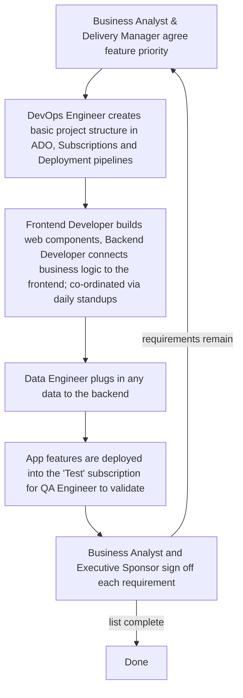

# Quality Diagnosis <!-- 500 words -->

The organisation is seeking to speed up application delivery by leveraging AI in both product design and development. This has knock-on effects for how software quality is guaranteed, changing project delivery timescales and the legacy agile-based (Gitlab, n.d.) app design, governance, coding, testing and change management process. We look at the current process first, to compare it with the new AI-driven approach.

## Current Development Practice

Business analysts gather requirements driven by specific customer needs, which after a number of weeks or months becomes a Statement of Work (SOW).

A team is then formed around the SOW with each member having a role: Business Analyst, Executive Sponsor, Technical Architect, Frontend and Backend Developers, Data Engineer, QA Engineer, Delivery Manager and DevOps Engineer.

The team starts work on delivering against the SOW and producing a High Level Design (HLD) document.

This document goes to the Digital Design Authority (DDA) for technical review, then the Change Advisory Board (CAB) for business review, focused on whether security, testing and deployment policies have been followed to mitigate organisational risk and prevent major outages (Atlassian, n.d.).

Development _can_ start before the CAB has approved the approach but an App cannot be deployed into the production environment without approval. 

Generally all development follows the loop below: -



*Figure 1: Development Loop*

## Design and Testing as related to Software Quality Outcomes

Historically developers handed code to QA, which shuttled it back and forth fixing bugs before handing off to operations; their relationship with it ended at delivery.

`You build it, you run it` (Thoughtworks, 2016) has not been the operating model here, and design patterns were not used. 

Testing has been entirely manual, following a Test Plan managed inside Azure DevOps (ADO) that requires a QA Engineer to loop through every test to find bugs.

Given the organisation's move to both an AI driven product prototype phase and LLM coded applications how do we maintain software quality? According to Patil, A (2025) over 200 papers have been written on SQA with LLM's and research activity is accelerating. 

AI has been used to address existing design and testing quality gaps, especially where developers using AI may not fully understand the code the LLM outputs (Martin, 2026).

## Current Quality Gaps

### Application testing gaps 

Developers have not had to write unit tests because they could simply hand over their application changes to the QA Engineer. 

This is inadequate: a refactoring change to delete security tokens after use had a code path where 'cleanup' occurred before the page was resubmitted, breaking the application. 

```typescript
def cleanup(self):
    """Cleanup resources"""
    if hasattr(self, 'session'):
        self.session.close()
        logger.info("[AUTH][AZURE] HTTP session closed")
```

*Figure 2: token cleanup introduced*

Cleanup added to close the http session properly, which includes deleting the JWT security token.


*Figure 3: dialog close error*

CloseDialog() was subsequently called in an unmodified part of the code (in red), requiring a hotfix so it ran after OnSuccessCallBack — otherwise the session closed before the UI changes saved, returning a 'missing auth token' failure.

This change was committed into git on the day before the app was due to go live.

### Developers not reading the application code

Another example of abdicating responsibility to AI: end users noticed the app's 'last updated' date was hard-coded to read "May 2025" in the HTML, unnoticed by the AI app creation team, who hadn't spent time reading the codebase. 

Other code queries were put to AI rather than investigated directly, risking a loss of critical thinking skills (Field, 2025).

### Code quality and security scanning in deployment pipelines

Pipelines deployed code without automated checks (static analysis, security scanning, tests) so there was no consistent verification of new features as releases moved through environments. 

The team implemented SonarQube running in a container to exercise numerous automated tests, linting and other configuration checks. 

Misconfigured cloud resources are a leading cause of security breaches (Ashwood, 2024), so Trivy was added to scan the Terraform (IaC) resource pipeline before deployment to Azure.

### Antiquated Change Process

Spending weeks writing a High Level Design (HLD) document, then asking people unfamiliar with the code to pronounce on risk, looks like security theatre (Deploy, n.d.).

Any retained change process should focus on automated security checks, test results, code review and release stage gates, not a manual process based on 2013 ITIL (Octopus Deploy, n.d.).

## Why make improvements?
These are just some of the issues identified, even before AI developer tools were introduced. If AI's goal is to enhance developer productivity (Plandek.com, 2026), testing must improve to cope with this increased change rate — hence adding code quality scanning, test coverage metrics, security checks and other pipeline enhancements that previous non-test-based approaches could not support.

Comparing the previous process to the new AI-generated-code methodology using the ISO/IEC 25010 quality framework (Sonar, 2026) shows more testing is being introduced because: 

> Engineering teams can generate software faster than they can confidently verify its quality. (Sonar, 2026)

These checks are being baked into the pipeline because this speed of change demands it. Previously, developers had more psychological safety because they fully understood every change made. Coupling higher delivery speed and productivity demands with offloading coding to AI means results are trusted far less — pulling through an insistence on a much wider suite of automated tests.

<!--
LO1 | K21 | 500 words

CONTENT TO COVER:
- Organisation's current development practice located within the SDLC
- Relationship between design practices, testing activity, and software quality outcomes
- Identification of at least two specific quality gaps with business impact
- The case for the improvements explored in the rest of the project

TO REACH B:
- Analyse quality implications in depth using evidence from the organisation
- Connect identified gaps explicitly to specific SDLC stages
- Show how design and testing decisions interact to produce quality outcomes
- Support diagnosis with credible external evidence (peer-reviewed research, white/green papers,
  benchmarking studies, standards/frameworks) and explain how it applies to your SDLC context

TO REACH A:
- Critically evaluate current practice against professional standards and emerging approaches
  (e.g. shift-left testing, architectural review practices)
- Synthesise evidence from multiple credible sources, compare viewpoints, and justify trade-offs
- Produce original insight into the organisation's quality position that clearly motivates
  the project's scope and direction
-->
