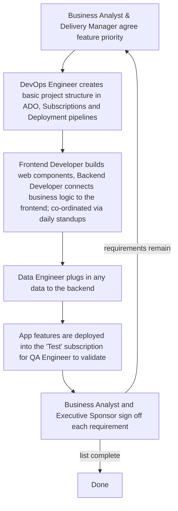
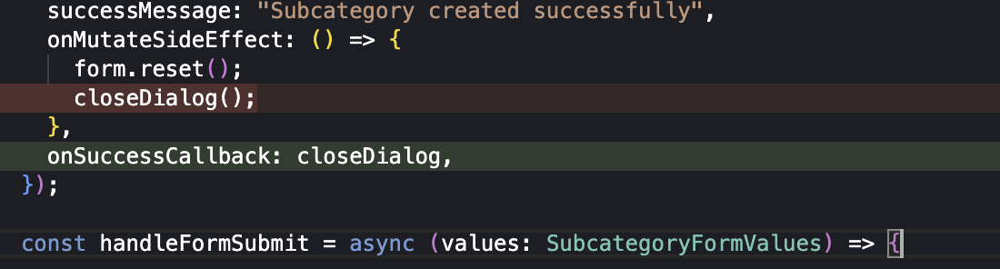

# Quality Diagnosis <!-- 500 words -->

The organisation is seeking to speed up application delivery by leveraging AI in both the product design and development phases.

AI's impact on the process of software delivery has knock on effects on how software quality is guaranteed.

AI has changed how project delivery timescales are managed. It also impacts the legacy agile based (Gitlab, n.d.) app design, governance, coding, testing and change management process so we'll look at that first in order to compare it with the new 'AI' driven approach.

## Current Development Practice

Business analysts, prompeted by specific customer needs, undertake a requirements gathering exercise which (after a number of weeks or months) makes it's way into a Statement of Work (SOW).

A team is then formed around the SOW with each member having a role: Business Analyst, Executive Sponsor, Technical Architect, Frontend and Backend Developers, Data Engineer, QA Engineer, Delivery Manager and DevOps Engineer.

The team starts work on delivering against the SOW and producing a High Level Design (HLD) document.

This document goes to the Digital Design Authority (DDA) for technical review and then to the Change Advisory Board (CAB) for a broader business review. The CAB is primarily focussed on whether all the organisations security, testing and deployment policies have been followed since their goal is to mitigate organisational risk and prevent major outages. (Atlassian, n.d.)

Development _can_ start before the CAB has approved the approach but an App cannot be deployed into the production environment withouth approval. 

Generally all development follows the loop below: -



*Figure 1: Development Loop*

## Design and Testing as related to Software Quality Outcomes

Historically developers would hand the code to QA and this would shuttle back and forth fixing bugs before it was handed off to operations to run. Their relationship with it would end having delivered it.

`You build it, you run it` (Thoughtworks, 2016) has not been the operating model here, and the software wouldn't have been developed with any design patterns in mind. 

Testing has been entirely manual following a Test Plan created and managed inside Azure DevOps (ADO) that requires a QA Engineer to loop through all the tests manually to find bugs.

Given the organisation's move to both an AI driven product prototype phase and LLM coded applications how do we maintain software quality? Accoring to Patil, A (2025) over 200 papers have been written on SQA with LLM's and research activity is accelerating. 

Ai has been used to address existing design and testing to address software quality gaps, especially where the developer using AI may in fact not fully understand the code being output by the LLM (Martin, 2026)

## Current Quality Gaps

### Application testing gaps 

Developers have not had to write unit tests because they could simply hand over their application changes to the QA Engineer. 

This is an inadequate approach. An example of this is when a refactoring change was made to delete security tokens after they were used. There was a specific code path where this 'cleanup' occurred before the page was resubmitted, therefore breaking the application. 

```typescript
def cleanup(self):
    """Cleanup resources"""
    if hasattr(self, 'session'):
        self.session.close()
        logger.info("[AUTH][AZURE] HTTP session closed")
```

*Figure 2: token cleanup introduced*

Cleanup added to close the http session properly, which includes deleting the JWT security token.



*Figure 3: dialog close error*

Subsequently CloseDialog() was called in an unmodified part of the code (in red) which had to be hotfixed into production to run AFTER OnSuccessCallBack. Otherwise the session just closed (before being able to save the changes in the UI) and returned a 'missing auth token' failure.

This change was committed into git on the day before the app was due to go live.

### Code quality and security scanning in deployment pipelines

Pipelines deploy code without automated checks (static analysis, security checking, running tests before deployment) so there's no permanent checking of new features or promoting them through environments as releases are made. 

The team implemented SonarQube running in a container to exercise a large number of automated tests, linting and other configuration checking features. 

Miss-configured cloud resources being one of the main reasons for security breakes (Ashwood, 2024) so we added Trivy to scan the terraform (infrastructure as code) resource deployment pipeline before they're created in Azure.

### Antiquated Change Process

Writing a High Level Design (HLD) document for weeks and somehow expecting a group of people who are distinctly unfamiliar with the code or the application to make a pronouncement about risks or other aspects of go live is painfully outdated. 

If a change process needs to be retained it should focus on whether there is automated security checking, automated and manual testing results,  code review and stage gates for releases, not some manual divinatory process based on 2013 ITIL (Octopus Deploy. n.d.)

## Why make improvements?
Above are just some of the issues identified, even prior to the introduction of AI developer apps. If the goal of AI is to enhance developer productivity (Plandek.com, 2026) then testing must be improved in order to cope with this increased change rate. This led to including code quality scanning, test coverage metrics, security checks and other enhancements to the automated deployment pipeline because previous non-test based approaches would not be able to cope with the frequency of change in the application code.

If we use ISO/IEC 25010 Framework for software quality (Sonar, 2026) to compare the previous development process to the new methodology that AI generated code sits on we find that more testing is being introduced because: 

> Engineering teams can generate software faster than they can confidently verify its quality. (Sonar, 2026)

These additional checks are being baked into the software deployment pipeline precisely because this speed of change necessitates it. In the previous application development process there was more psychological safety for developers because they would fully understand all the changes being made. Coupling the increased demand for delivery speed and productivity with offloading coding to AI results in a situation where the results are trusted far less, which in fact pulls through this insistance on a much wider suite of automated tests.

<!--
LO1 | K21 | 500 words

CONTENT TO COVER:
- Organisation's current development practice located within the SDLC
- Relationship between design practices, testing activity, and software quality outcomes
- Identification of at least two specific quality gaps with business impact
- The case for the improvements explored in the rest of the project

TO REACH B:
- Analyse quality implications in depth using evidence from the organisation
- Connect identified gaps explicitly to specific SDLC stages
- Show how design and testing decisions interact to produce quality outcomes
- Support diagnosis with credible external evidence (peer-reviewed research, white/green papers,
  benchmarking studies, standards/frameworks) and explain how it applies to your SDLC context

TO REACH A:
- Critically evaluate current practice against professional standards and emerging approaches
  (e.g. shift-left testing, architectural review practices)
- Synthesise evidence from multiple credible sources, compare viewpoints, and justify trade-offs
- Produce original insight into the organisation's quality position that clearly motivates
  the project's scope and direction
-->
