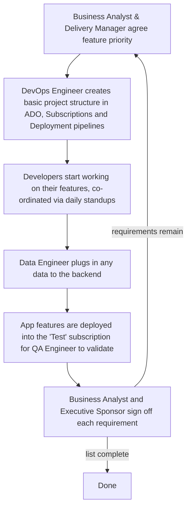

# Quality Diagnosis <!-- 500 words -->

The organisation is seeking to speed up application delivery by leveraging AI in both the product design and development phases. 

AI's most significant impact has been on how the timeline expectations around software are managed. This mutates the legacy app design, governance and change management process. We will look at the current process first.

## Current Development Practice

Business analysts, prompeted by specific customer needs or executive suggestions, undertake a requirements gathering exercise which (after a number of weeks or months) makes it's way into a Statement of Work (SOW).

A team, like the one below, is then formed around the SOW with each member having a function.

| Team Member | Role  |
| ----------- | ----- | 
| Business Analyst    | Gathers anr interprets the requirements into User Stories & Functional and Non-Functional Requirements |
| Executive Sponsor   | Reports to other Management level leaders about the state of the app, any issues or risks |
| Technical Architect | Ensures that the app meets the organisation's security and architecture standards |
| Frontent Developer  | Delivers the app 'frontend' or web components usually using a Javascript framework of some sort |
| Backend Developer   | Connects the backend business logic to the frontend |
| Data Engineer       | Securely connects the app data to the remote database it is stored in | 
| QA Engineer         | Writes test plans, unit, smoke tests and integration tests for the application |
| Delivery Manager    | Guides the day-to-day work to deliver the application |
| DevOps Engineer     | Automates any cloud based infrastructure required to deploy the app into production |

Figure 1: Development team members

The team then starts work on deliverying against the SOW and producing a High Level Design (HLD) document which aims to fully answer the following questions about the new app. 

This document goes to Digital Design Authority (DDA) first for technical review and then to the Change Advisory Board (CAB) for a broader business review. The CAB is primarily focussed on whether all the organisations security, testing and deployment policies have been followed since their goal is to manage organisational risk. (TODO: find a quote for this paragraph)

Development _can_ start before the CAB has approved the approach but an App cannot be launched into production (use) before this point. Additional enhancements to deployment automation, network security and monitoring might be made to the production deployment before go live but generally all development follows the loop below: -

Figure 2: Development Loop

## Design and Testing as related to Software Quality Outcomes

(TODO: need to write more about the Design aspect of Software quality as an outcome!)

The standard approach was that developers would possibly write unit tests (REF: how ofter TDD really) but generally this would be omitted with some input from the Technical Architect about which software patterns to use (REF: get a quote for this). 

In this organisation at least, the majority of test cases were manual following a Test Plan created and managed inside Azure DevOps (ADO) that required a QA Engineer to loop through all the tests individually and find bugs manually.

Given the organisation's move to both AI driven product development (TODO: Link to further chapter here) and AI agent implemented Application code, driven from the requirements backlog this necessitates filling some gaps 

<!--
(TODO: rewrite this, it's not clear what the point is) -->

## Current Quality Gaps

### Gap 1 <!-- change this title -->
No incentive for Developers to write unit tests, integrate these into an App deployment framework or even consider end-to-end (smoke) testing. 

They can simply had their application changes to the QA Engineer. (TODO: Quote ref Observability and "you build it you run it" as well as Programmer Anarchy <-- reference this >)

Leads to issues where refactoring changes (the cleanup example) introduced a bug on the day of go live

### Gap 2 <!-- change this title -->
Pipelines deploy code without enough automated checks (static analysis, security checking, running tests before deployment, so there's no permanent checking of new features) or promoting them through environments as releases are made. REF: SonarQube

<!-- figure out how to make this point better -->
### Gap 3 <!-- change this title -->
Replace the CAB with a platform because writing documents for weeks and somehow expecting a bunch of people who are distinctly unfamiliar with the code to make a pronouncement about risks or other aspects of go live or not is security/technical theatre. Focus on security checking, actual feedback, code review and stage gates for releases, not some manual divinatriy process from 2013 ITIL (REF: find a quote for this again)

## Why make these improvements?
MEASURABLE metrics for better code quality, security checking, tracks real changes within a software deployment process being executed by the people doing the work. 

Ready the organisation for the future of AI driven product delivery and development.

<!--
LO1 | K21 | 500 words

CONTENT TO COVER:
- Organisation's current development practice located within the SDLC
- Relationship between design practices, testing activity, and software quality outcomes
- Identification of at least two specific quality gaps with business impact
- The case for the improvements explored in the rest of the project

TO REACH B:
- Analyse quality implications in depth using evidence from the organisation
- Connect identified gaps explicitly to specific SDLC stages
- Show how design and testing decisions interact to produce quality outcomes
- Support diagnosis with credible external evidence (peer-reviewed research, white/green papers,
  benchmarking studies, standards/frameworks) and explain how it applies to your SDLC context

TO REACH A:
- Critically evaluate current practice against professional standards and emerging approaches
  (e.g. shift-left testing, architectural review practices)
- Synthesise evidence from multiple credible sources, compare viewpoints, and justify trade-offs
- Produce original insight into the organisation's quality position that clearly motivates
  the project's scope and direction
-->
