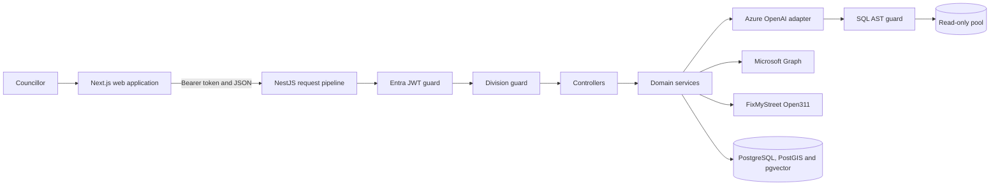
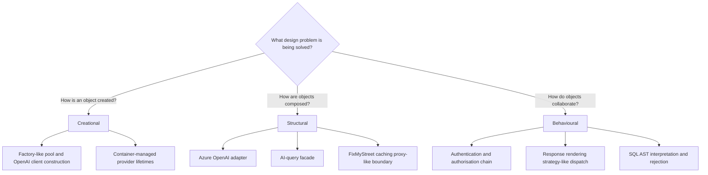

# Design Evaluation and Architectural Decisions <!-- 1100 words -->

As part of a new client application delivery model this was created using AI in order to significantly reduce time to deployment from 4-6 months to approximately 8 weeks. A component of this agentic harness is that is already creates Architectural Decision Records (ADR's) as it proceeds through feature delivery.

## Application and architectural analysis

The app is a TypeScript monorepo comprising a Next.js web client frontend and a modular NestJS API for connecting to a Postgresql database.

The browser accesses the backend through one API wrapper, while NestJS controllers delegate to domain services for jobs, schemes, drainage, verges, knowledge retrieval and AI-assisted querying.

NestJS dependency injection (DI) composes these services and a global database module provides separate owner and read-only connection pools. 

This is broadly a layered, modular-monolith architecture rather than microservices: deployment is simple and cross-feature calls remain local, but the API modules still establish boundaries from which services could later be separated if operational evidence justified it.

*Figure 3: Principal components and trust boundaries.*

The principal coupling is therefore to abstractions supplied by NestJS and to locally defined service APIs, not directly between pages and data stores. This improves replaceability and permits tests to inject pool and credential doubles. However,`AiQueryService` coordinates prompt construction, retrieval, SQL execution and response formatting, making it a high-coupling orchestration point. 

`FixMyStreetController` similarly contains HTTP integration, cache state, geographic calculation and request handling. These choices are proportionate for a demonstrator, but increase the number of reasons each class may change and make isolated tests harder.

## Design-pattern evaluation

The three pattern categories are distinguished by the design problem they solve, not merely by pattern names. Creational patterns control **how objects are made**; structural patterns control **how objects are composed**; and behavioural patterns control **how objects communicate and allocate responsibility** (Gamma *et al.*, 1994). The classification below applies those questions to the implemented code.

*Figure 4: Pattern categories distinguished by concern and mapped to the application.*

The database module's `buildPoolConfig()` and the OpenAI service's `buildAzureClient()` centralise construction decisions. They are **factory-like functions**, but not textbook Factory Methods because subclasses do not override a creation operation. NestJS providers and the exported MSAL instance have singleton lifetimes in their relevant containers, although this is framework-managed lifecycle configuration rather than an explicit GoF Singleton. This distinction avoids claiming pattern sophistication that the code does not possess.

The clearest structural pattern is **Adapter**. `AzureOpenAiService` translates the application's existing `invoke` contract and Anthropic-style tool definitions into Azure OpenAI function calls. Callers therefore remained stable when AWS Bedrock was replaced. This reduces migration cost, although consumers inject the concrete class rather than a local interface or token, so replacement is not fully decoupled.

`AiQueryService` acts as a **Facade**, presenting controllers with one operation while coordinating LLM, knowledge-base and spatial services. The shared FixMyStreet cache has proxy-like behaviour because it controls access to a remote Open311 service, but placing that behaviour in a controller conflates structural integration with transport logic.

The NestJS request pipeline most closely resembles behavioural **Chain of Responsibility**. An Entra guard authenticates, a division guard authorises and an interceptor records timing before a controller executes; each stage can terminate the request. In the client, `RichResult` selects map, chart, statistic, timeline or table rendering from `response_type`. This is strategy-like dispatch, not a formal Strategy pattern because alternatives are conditional branches rather than interchangeable objects. With a small stable set of renderers, that simpler implementation is more proportionate than a hierarchy of strategy classes. Similarly, NestJS `@Public()` is a language decorator carrying metadata, not the GoF Decorator pattern, because it does not wrap an object to extend behaviour.

## Quality implications

These patterns interact positively with security and testability. Centralised authentication prevents controllers from inconsistently enforcing identity, while DI allows guards and services to be tested using fake dependencies. The OpenAI adapter localises vendor-specific APIs, and the database factory enforces bounded pools and fail-fast configuration. Together these support ISO/IEC 25010 characteristics of maintainability, security and reliability (ISO, 2023). Nevertheless, patterns do not automatically improve quality: empirical work shows their effect depends upon context and implementation rather than pattern presence alone (Khomh and Guéhéneuc, 2008).

The main trade-offs are concentration of responsibility and runtime dependency. `AiQueryService` is easier for controllers to consume but has a broad test surface. Ward authorisation depends on Microsoft Graph; caching improves performance and
availability but permits entitlement revocation to remain stale for up to 15 minutes on each application instance. Failing closed on an empty cache favours confidentiality over availability, consistent with zero-trust guidance (Rose *et al.*, 2020). Keeping a local in-memory cache instead of introducing Redis is proportionate at demonstrator scale; distributed caching should follow measured scale-out or revocation requirements, not speculative complexity.

## Architectural Decision Record recommendations

### ADR 1: Retain Entra-issued JWT authentication and attribute-based ward authorisation

**Status:** Recommended, reflecting implemented ADR-004 and ADR-013. **Context:** Ward data must not be anonymous or visible across councillor boundaries. Entra does not replace JWT: Entra is the identity provider that issues JWT access tokens, which the global guard validates by issuer, audience and signature. Because Custom Security Attributes are not token claims, the API retrieves ward assignments from Graph using the stable object ID and applies deny-by-default authorisation.

**Decision:** Retain global authentication followed by a separate division guard; use the configured ward attribute as the single access source, cache it for 15 minutes and fail closed when an entitlement cannot be established. **Alternatives:** per-controller checks risk inconsistent enforcement; email identity is mutable; and fail-open caching could disclose data during a Graph outage. **Consequences and tests:** Graph is an availability dependency and revocation is not immediate. Unit tests should verify invalid issuer/audience, absent attributes, cache expiry and 401/403/503 distinctions; integration tests should prove one ward cannot read another. This supports councillor reuse of managed accounts while reducing both administration and data-protection risk.

### ADR 2: Retain defence-in-depth for LLM-generated PostgreSQL queries

**Status:** Recommended, reflecting implemented ADR-009. **Context:** A language model can be manipulated through prompt injection, so generated SQL cannot be trusted merely because the user is authenticated. A previous string-prefix `SELECT` check would not reliably detect stacked or disguised statements.

**Decision:** Parse generated SQL into an abstract syntax tree, permit exactly one `SELECT`, execute it through a separately provisioned read-only pool and preserve row level ward scoping. **Alternatives:** prompt instructions alone provide no enforceable boundary; a parser alone can contain defects; and removing natural-language querying would discard its business value. **Consequences and tests:** the parser and second pool add dependency and configuration cost, but independent controls limit impact when one fails. Parameterised application queries should remain the default outside this exception (OWASP, 2025). Tests should include comments, malformed SQL, multiple statements, DDL/DML, CTEs and cross-division attempts, plus a database integration test proving the read-only role cannot write. This is proportionate because the threatened data and AI-generated execution boundary justify stronger controls than ordinary fixed-query endpoints.

<!--
LO2 | K22, K23 | 1,100 words

CONTENT TO COVER:
- Analysis of the design and architectural characteristics of the chosen system
- Evaluation of design patterns present or absent - creational, structural, behavioural
- Assessment of coupling, structural decisions, and quality implications
- Architectural Decision Record (ADR) documenting at least two recommended improvements with testability implications and business justification

TO REACH B:
- Analyse how design decisions (pattern selection, coupling, structural choices) interact to affect software quality and testability
- Justify recommendations with context-specific evidence
- Demonstrate proportionality - show awareness of when simpler solutions are preferable to complex pattern implementations
- Support evaluation with credible external evidence (peer-reviewed research, white/green papers, standards/frameworks) and explain how it strengthens judgement about proportionality

TO REACH A:
- Critically evaluate the system's design against organisational quality requirements
- Synthesise an ADR demonstrating sophisticated professional judgement: e.g. where a pattern introduces unnecessary complexity, where deferred decisions are strategically sound, or where competing design forces require explicit trade-off reasoning
- Synthesise evidence from multiple credible sources to justify architectural trade-offs
-->
