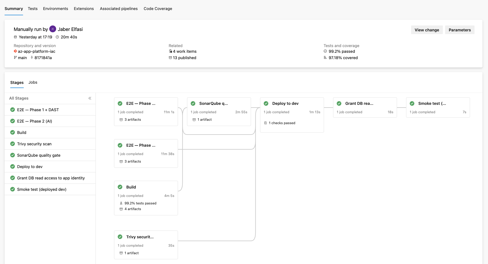
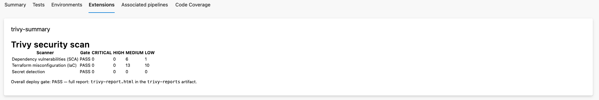
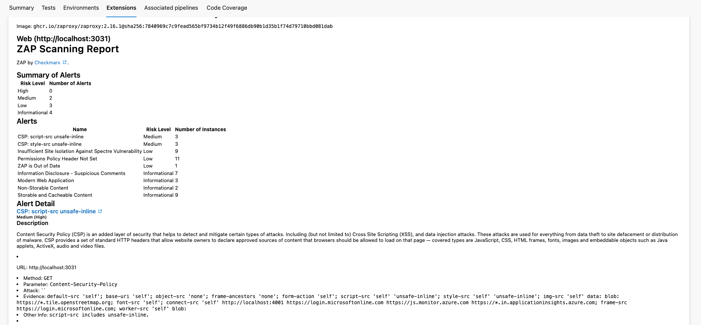
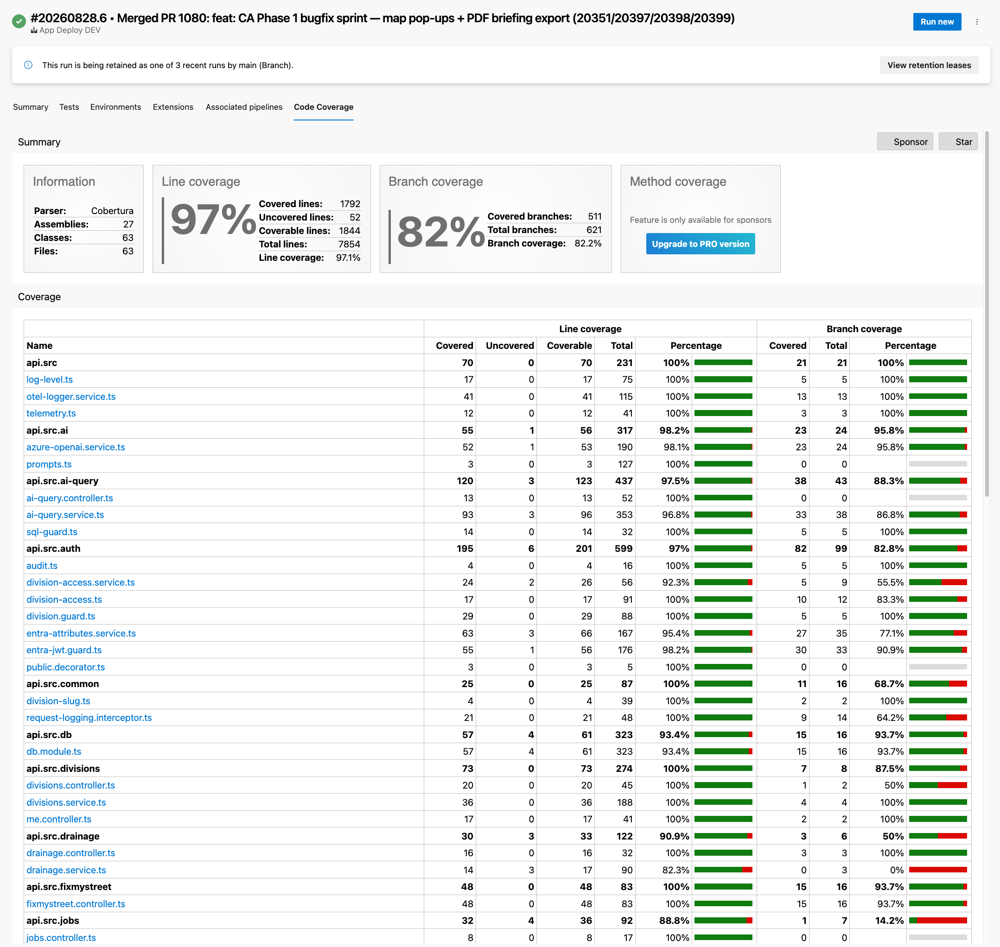

# Testing Strategy and Implementation <!-- 1100 words -->

Using an agentic AI harness to write automated tests, adding checks to deployment pipelines and even running a 'smoke test' post deploy leads to a high confidence that if application changes pass through this pipeline it will function as intended.

*Figure: App Deployment Pipeline*

Code changes must pass through several stages: -

1. E2E - phase 1 - Runs OWASP (ZAP) against the app code
2. E2E - phase 2 - checks the OpenAI (Azure Foundry) endpoint
3. Build - creates zips for deployment & runs unit tests
4. Trivy - infra security scan
5. SonarQube quality gate - runs checks on previous tests and decides whether deployment should continue
6. Deploy to dev
7. Grant access to DB from Azure DevOps
8. Smoke test checks the deployed API and Web endpoints are healthy

Additionally there's a QA who checks the AI generated tests, overall test process and produces a test plan.

Importantly they are _still_ carryind out manual test, investigative tests and in this case are spending significant time making sure that non-standard client devices (mobiles, tablets) can render the frontend UI properly.

## Testing strategy

' Developers don't write tests for their own work but AI seems to be allowed to do so??'

### Additional deployment pipeline based checks

Deploying the Azure resources (infrastructure) and application using a CI/CD pipeline means that automated checks can be added to mitigate various issues that might not be uncovered through the normal code review process.

Trivy (REF:) is a Terraform code scanning tool used to look for configuration lapses in security. This checks all the infrastructure-as-code (IaC) for vulnerabilities. The various resources that are deployed to host the application may of course work but it could contain holes that a DevOps engineer might miss. 

*Figure: Trivy IaC security scan results.*

Where Trivy checks the infrastructure, OWASP ZAP (REF:) probes the running application itself. It acts as a proxy between a browser and the deployed web app, attacking it the way an external user would — spidering pages, fuzzing inputs and flagging common weaknesses such as missing security headers, cross-site scripting and injection points. This matters because an application can pass code review and still ship an exploitable flaw: a missing header or an unvalidated input only becomes visible once the app is actually running and responding to hostile requests.

*Figure: OWASP ZAP dynamic scan report.*

*Figure: OWASP code coverage scan*

## Limitations in coverage

### Client mobile devices

## Testing Strategy Evaluation

<!--  onnect design decisions, testing outcomes, and quality impact in an original and professionally convincing way -->

<!--
LO3 | S21 | 1,100 words

CONTENT TO COVER:
- Testing strategy mapped to relevant SDLC stages
- How design decisions from Section 2 shaped the testing approach
- Test suite implementation: automated tests, black-box and white-box techniques, boundary analysis
- CI/CD integration and tooling
- Test results and coverage
- Refinement of approach based on outcomes and evaluation of effectiveness

TO REACH B:
- Analyse testing outcomes and explicitly refine the approach based on results
- Evaluate the effectiveness of techniques used and identify limitations in coverage
- Connect testing findings explicitly to the quality improvements sought
- Support strategy evaluation with credible external evidence (peer-reviewed research white/green papers, standards/frameworks) and explain how it informed technique selection, refinement, and coverage decisions

TO REACH A:
- Critically evaluate the testing strategy as a whole: what it proved, what it missed,and what the results mean for software quality in the organisational context
- Synthesise evidence from multiple credible sources, compare testing approaches, and justify trade-offs
- Connect design decisions, testing outcomes, and quality impact in an original and professionally convincing way
-->
