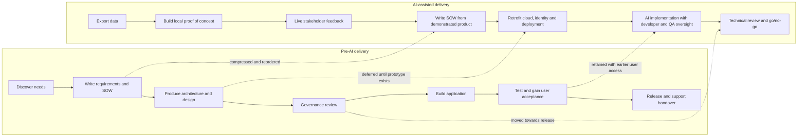

# Stakeholder Communication and Professional Practice <!-- 700 words -->

## How AI changed the software delivery process

As mentioned previously, the application was created through a new AI-assisted design and delivery process. The historical software creation process would be to gather requirements, produce a specification and refined it between a Product Owner and stakeholders before handing it to a development team. 

Stakeholders being directly involved in the product definition process via AI introduces some new dynamics, not all of them positive...

### Positive impacts

- Stakeholders are more involved in the application development process which increases their sense of involvement and ownership
- Requirements are directly communicated to developers through the delivery of working code
- Initial requirements discovery and the definition of what's needed can take as little as a day, rather than via conceptual and process focussed discussions over a number of weeks required to produce a specification 

### Negative effects

Non-technical stakeholders may develop an overly optimistic view of delivery timescales. 

This makes subsequent expectation management conversations challenging because their own experiences are going to contradict someone telling them the actual delivery might take several months.

They've worked wonders in a day, without the real-world constraints of deploying to the Cloud, security access, GDPR rules around data or even being able to connect to the 'real' data at all.

## Four-stage AI-assisted lifecycle

### Stage 1: Stakeholder co-creation and proof of concept

- The client data team exports a point-in-time CSV dataset for the AI context.
- Leadership works with AI co-creation specialists to build a local proof of concept.
- OpenAI API calls demonstrate how users could interrogate the data conversationally.
- Stakeholders make design decisions and give live feedback while the interface evolves.
- The commercial team writes the Statement of Work (SOW), including functional and
	non-functional requirements, after the proof of concept has established the concept.

> **Human-in-the-loop checkpoint 1:** Leadership and client stakeholders decide which
> prototype behaviour is valuable enough to formalise in the SOW. The AI accelerates
> production of options; people remain accountable for product intent and acceptance.

### Stage 2: Engineering the prototype for Azure

- An application platform is established in the client's Azure tenant.
- The prototype code is imported into a repository and deployment is automated.
- Engineers adapt code that was not initially cloud-native: PostgreSQL becomes hosted,
	OpenAI endpoints are replaced by Azure AI Foundry, and Entra ID authentication is
	introduced.
- A development instance is deployed and the team receives controlled access.

> **Human-in-the-loop checkpoint 2:** Engineers decide how the prototype must change to
> meet identity, data, hosting and deployment constraints. Technical feasibility and
> security are human accountabilities, not outputs accepted solely because the AI
> generated working code.

### Stage 3: AI-assisted implementation and testing

- The SOW is converted into Azure DevOps user stories and supplied to the AI harness.
- The harness implements requirements and produces unit and functional tests.
- Developers and QA supervise the implementation loop; the QA team member is the
	principal human-in-the-loop for test evidence. Further detail is provided in
	[Testing Strategy and Implementation](3_testing_strategy_and_implementation.md).
- Product questions return to the client Product Owner instead of being inferred by the
	implementation team or AI.
- A test group of end users receives early access and supplies usability feedback.
- Testing, security and networking evidence is presented to the technical oversight
	group.
- The Product Owner and client application sponsor gather and prioritise feedback.

> **Human-in-the-loop checkpoint 3:** QA assesses generated test evidence, developers
> review implementation quality, the Product Owner resolves product ambiguity and end
> users validate whether the application works in its real context.

### Stage 4: Go/no-go and operational handover

- Stakeholders assess security, monitoring, support requirements, ongoing cost, high-
	and low-level design, and testing evidence.
- A human go/no-go decision controls wider enrolment and handover to the support team.

> **Human-in-the-loop checkpoint 4:** Accountable stakeholders accept or reject the
> residual business, technical and operational risk. AI provides delivery artefacts and
> evidence but does not authorise production use.

## Stakeholders and feedback opportunities

| Stakeholder | Communication or collaboration point | Feedback opportunity | Decision retained by people |
| --- | --- | --- | --- |
| Leadership and client sponsor | Live proof-of-concept sessions | Product value, priorities and viability | Continue, redirect or stop investment |
| Product Owner | SOW definition and product-question escalation | Clarify acceptance criteria and resolve ambiguity | Accept and prioritise requirements |
| Developers and QA | Implementation reviews and test results | Defects, test gaps and maintainability concerns | Accept, reject or revise generated work |
| End-user test group | Early access to the development instance | Usability and fitness for the operational context | Recommend changes before wider release |
| Technical oversight group | Security, networking, architecture and test presentation | Compliance concerns and residual technical risk | Require remediation or recommend approval |
| Go/no-go stakeholders | Release-readiness meeting | Cost, monitoring, support and design concerns | Authorise release and handover |

*Table 2: Human feedback and decision points across the AI-assisted lifecycle.*

## What the accelerated process changed

*Figure 5: Comparison of the pre-AI sequence and the AI-assisted lifecycle.*

| Pre-AI activity | Change in the AI-assisted process | Quality implication |
| --- | --- | --- |
| Requirements elicitation before implementation | **Compressed and reordered:** the prototype preceded the formal SOW | Faster discovery and more tangible feedback, but prototype choices may become requirements without sufficient challenge |
| High- and low-level design before construction | **Deferred:** cloud architecture was addressed after local code existed | Rapid validation of value, but later rework was required for PostgreSQL, Azure AI Foundry and Entra ID |
| Architecture, security and governance review before build | **Initially bypassed, later restored:** technical oversight occurs after development deployment | Decisions use working evidence, but material risks may be discovered after sunk effort |
| Cloud and deployment constraints | **Missed from the initial prototype:** it ran locally against static data | Low-cost experimentation, but the proof of concept did not establish deployability, scalability or live-data behaviour |
| Test design alongside requirements | **Deferred to Stage 3:** AI generated tests under developer and QA oversight | Automation can accelerate coverage, but late test design may preserve ambiguous or untestable requirements |
| End-user acceptance near the end | **Brought forward:** a test group accesses the development instance | Earlier usability evidence reduces the risk of technically correct but unsuitable features |
| Monitoring, support and cost planning | **Deferred to go/no-go:** assessed before wider release | Avoids over-engineering an unproven idea, but late operational findings can delay or prevent release |

*Table 3: Activities compressed, deferred, omitted initially or moved earlier.*

The process therefore shortened discovery-to-demonstration time, but did not eliminate
the work required for a supportable service. It changed when that work occurred and who
encountered its risks. The strongest feature was continuous access to a tangible product
for stakeholder feedback. The principal weakness was that architecture, security,
testing and operational questions followed the prototype, creating pressure to retrofit
quality into code that stakeholders already perceived as nearly complete.

## Critical evaluation of the communication strategy

### What worked and why

### What I would do differently

### How communication was adapted for technical and non-technical audiences

### Collaborative practice 1: Live design critique and its impact

### Collaborative practice 2: Test-result review and its impact

### Specific feedback that changed a design decision

### Specific feedback that changed the testing approach

### Professional standards applied throughout the lifecycle

### Evidence of sustained commitment to quality

### Impact on the team and organisation

### Trade-offs between delivery speed, assurance and stakeholder participation

### Comparison with alternative communication and collaboration approaches

### Evidence base and justification

<!--
LO4 | K8, B1 | 700 words

CONTENT TO COVER:
- Communication of design decisions and quality outcomes to technical and non-technical stakeholders
- Evidence of at least two collaborative practices (e.g. peer review, design critique, test result presentation) with reference to their impact on the project
- Application of professional standards throughout the project
- Impact of the work on the team or organisation

TO REACH B:
- Analyse the effectiveness of stakeholder communication and collaborative practice
- Provide specific examples of how feedback received influenced design or testing decisions
- Demonstrate sustained commitment to quality throughout the project lifecycle
- Support approach with credible external evidence (peer-reviewed research, professional standards/frameworks) and explain how it informed audience adaptation and collaborative practices

TO REACH A:
- Critically evaluate the communication and collaboration strategy as a whole: what worked, what you would do differently, and how your approach reflects the professional standards expected of a senior software engineering practitioner
- Synthesise evidence from multiple credible sources to justify trade-offs in communication and collaboration strategy
-->
