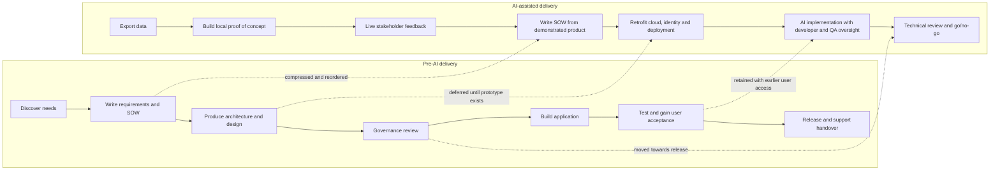

# Critical Evaluation and Recommendations <!-- 600 words -->

## Downsides to the introduction of AI

Non-technical stakeholders can develop an very optimistic view of delivery timescales after watching a working proof of concept appear in a day while unaware it that ran without the real-world constraints of cloud deployment, security access, GDPR obligations, or live data. 

This makes expectation-management conversations challenging, since they contradict that lived experience.

## What the accelerated process changed

*Figure 10: Comparison of the pre-AI sequence and the AI-assisted lifecycle.*

| Pre-AI activity | Change in the AI-assisted process | Quality implication |
| --- | --- | --- |
| Requirements elicitation before implementation | **Compressed and reordered:** the prototype preceded the formal SOW | Faster discovery and more tangible feedback, but prototype choices may become requirements without sufficient challenge |
| High- and low-level design before construction | **Deferred:** cloud architecture was addressed after local code existed | Rapid validation of value, but later rework was required for PostgreSQL, Azure AI Foundry and Entra ID |
| Architecture, security and governance review before build | **Initially bypassed, later restored:** technical oversight occurs after development deployment | Decisions use working evidence, but material risks may be discovered after sunk effort |
| Cloud and deployment constraints | **Missed from the initial prototype:** it ran locally against static data | Low-cost experimentation, but the proof of concept did not establish deployability, scalability or live-data behaviour |
| Test design alongside requirements | **Deferred to Stage 3:** AI generated tests under developer and QA oversight | Automation can accelerate coverage, but late test design may preserve ambiguous or untestable requirements |
| End-user acceptance near the end | **Brought forward:** a test group accesses the development instance | Earlier usability evidence reduces the risk of technically correct but unsuitable features |
| Monitoring, support and cost planning | **Deferred to go/no-go:** assessed before wider release | Avoids over-engineering an unproven idea, but late operational findings can delay or prevent release |

*Table 1: Activities compressed, deferred, omitted initially or moved earlier.*

The process shortened discovery-to-demonstration time but did not eliminate the work a supportable service needs; it changed when that work occurred and who carried its risks. 

Continuous access to a tangible product for stakeholder feedback was the strongest feature. 

The principal weakness was that architecture, security, testing and operational questions followed the prototype, creating pressure to retrofit quality into code that stakeholders already perceived as nearly complete.

## AI & Quality trade offs

While AI increases iteration speed and collaboration (Stage 4), it may result in a product that only continued AI use can maintain. 

Code quality still matters (Yu N, 2026), but _how_ a result is achieved may become secondary to _whether it works_. Maybe using enough LLM tokens can eventually produce a shippable product that achieves a business goal but without objectively high-quality code.

## Summary

Development has moved from 'Big Design up Front' (months of development), through 'Agile' (two-week iterations) and AI has now reduced the apparent change time to less than a day. 

Faster, lower-cost change without a parallel increase in testing and security checking will increase bugs, precisely because of this higher change frequency (CodeRabbit, 2026).
 
## Recommendations for the future

If this AI-accelerated development process is reused, keep these points in mind:

- Rapid code changes have knock on effects for the developers (stackoverflow, 2026) in terms of stress and psychological safety
- Complex applications don't suddenly become faster to deliver just because AI is being used and this shouldn't result in abdicating responsibility for managing client expectations around delivery dates
- AI use must be accompanied by an _increase_ in testing to compensate for the evidence that developers heavy use of AI doesn't guarantee they have paid attention to changes

<!--
LO3, LO4 | S21, K8, B1 | 600 words

CONTENT TO COVER:
- Critical evaluation of design decisions made - were they the right choices?
- Critical evaluation of the testing strategy - was it effective, what did it miss?
- Assessment of quality improvements achieved and gaps that remain
- Recommendations for next steps and future iterations
- Lessons learnt

NOTE: This section draws on both LO3 and LO4 - it should synthesise the whole project,
not introduce new evidence. Use it to show depth of reflection.

TO REACH B (LO3):
- Connect testing findings explicitly to the quality improvements sought
- Show determination, refinement, and adaptation in your approach

TO REACH B (LO4):
- Show sustained commitment to quality throughout the project lifecycle
- Apply professional standards with clear awareness of their purpose

TO REACH A:
- Produce original, professionally convincing conclusions that connect design decisions, testing outcomes, and quality impact across the project as a whole
- Synthesise evidence from multiple credible sources to justify trade-offs
- Reflect on how your professional practice shaped outcomes and what you would do differently
-->
