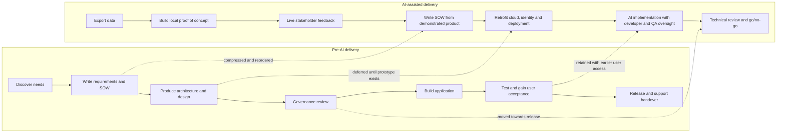

# Critical Evaluation and Recommendations <!-- 600 words -->

Remeber to mention the (new) AI driven process impact on the developers, especially with respect to code Understandability - ref: Understanding AI code quote. https://stackoverflow.blog/2026/05/21/coding-agents-are-giving-everyone-decision-fatigue/

- Testing & change frequency
- Automation CI/CD implemented from the start so we couldn't have a 'works on my machine' situation
- 

## Reflections on the introduction of AI as the primary development platform

Then, once the development team had worked for enough time on fulfilling the requirements, there would be a period where QA check everything before it's reviewed by the senior stakeholder and it's signed off. The ability to change the specification (what's being built) 

Agile an attempt to be more flexible - REF: for this - half way house

AI has begun to reduce the cost and impact of change within the legacy software delivery model. The reason for the 'big design up front' could be argued to be cost of change is expensive

Downsides to the introduction of AI

Non-technical stakeholders can develop an overly optimistic view of delivery timescales after watching a working proof of concept appear in a day. That makes later expectation-management conversations difficult, because their own experience contradicts being told that real delivery takes months. The prototype performed without the real-world constraints of cloud deployment, security access, GDPR obligations around data, or even a connection to live data.

## What the accelerated process changed

*Figure 9: Comparison of the pre-AI sequence and the AI-assisted lifecycle.*

| Pre-AI activity | Change in the AI-assisted process | Quality implication |
| --- | --- | --- |
| Requirements elicitation before implementation | **Compressed and reordered:** the prototype preceded the formal SOW | Faster discovery and more tangible feedback, but prototype choices may become requirements without sufficient challenge |
| High- and low-level design before construction | **Deferred:** cloud architecture was addressed after local code existed | Rapid validation of value, but later rework was required for PostgreSQL, Azure AI Foundry and Entra ID |
| Architecture, security and governance review before build | **Initially bypassed, later restored:** technical oversight occurs after development deployment | Decisions use working evidence, but material risks may be discovered after sunk effort |
| Cloud and deployment constraints | **Missed from the initial prototype:** it ran locally against static data | Low-cost experimentation, but the proof of concept did not establish deployability, scalability or live-data behaviour |
| Test design alongside requirements | **Deferred to Stage 3:** AI generated tests under developer and QA oversight | Automation can accelerate coverage, but late test design may preserve ambiguous or untestable requirements |
| End-user acceptance near the end | **Brought forward:** a test group accesses the development instance | Earlier usability evidence reduces the risk of technically correct but unsuitable features |
| Monitoring, support and cost planning | **Deferred to go/no-go:** assessed before wider release | Avoids over-engineering an unproven idea, but late operational findings can delay or prevent release |

*Table 3: Activities compressed, deferred, omitted initially or moved earlier.*

The process shortened discovery-to-demonstration time but did not eliminate the work a supportable service needs; it changed when that work occurred and who carried its risks. Continuous access to a tangible product for stakeholder feedback was the strongest feature. The principal weakness was that architecture, security, testing and operational questions followed the prototype, creating pressure to retrofit quality into code that stakeholders already perceived as nearly complete.

### AI & Quality trade offs

While AI does increase iteration speed and can increase collaboration (Stage 4) the real danger exists that it _may_ result in a product that only continued use of an AI can maintain. Code quality still matters (Yu N, 2026) but to a certain extent, _how the result is achieved_ may become secondary to _whether it works or not_ given that you could throw a large amount of LLM tokens at a problem long enough to achieve a shippable product.

It may not be objectively high quality code if that's the only metric you have but it would achieve a business goal

## Recommendations for future iterations

As the AI accellerated app development process is going to be re-used we should make the following mandatory

-
- 

As well as making the following improvements

- 

<!--
LO3, LO4 | S21, K8, B1 | 600 words

CONTENT TO COVER:
- Critical evaluation of design decisions made - were they the right choices?
- Critical evaluation of the testing strategy - was it effective, what did it miss?
- Assessment of quality improvements achieved and gaps that remain
- Recommendations for next steps and future iterations
- Lessons learnt

NOTE: This section draws on both LO3 and LO4 - it should synthesise the whole project,
not introduce new evidence. Use it to show depth of reflection.

TO REACH B (LO3):
- Connect testing findings explicitly to the quality improvements sought
- Show determination, refinement, and adaptation in your approach

TO REACH B (LO4):
- Show sustained commitment to quality throughout the project lifecycle
- Apply professional standards with clear awareness of their purpose

TO REACH A:
- Produce original, professionally convincing conclusions that connect design decisions, testing outcomes, and quality impact across the project as a whole
- Synthesise evidence from multiple credible sources to justify trade-offs
- Reflect on how your professional practice shaped outcomes and what you would do differently
-->
